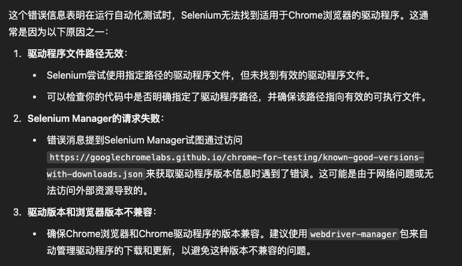
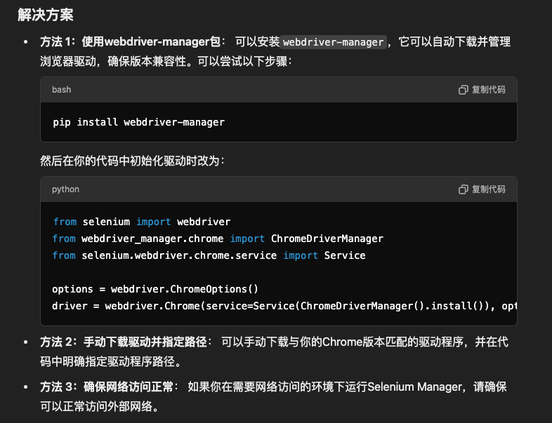
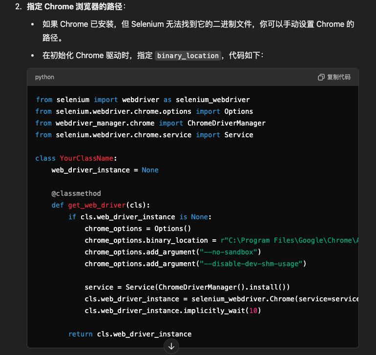
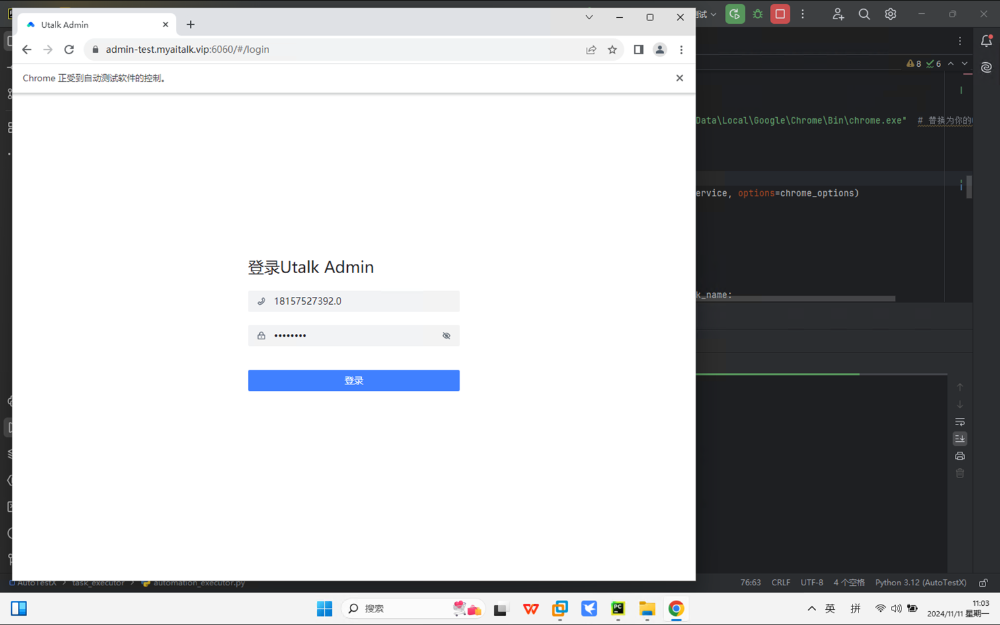
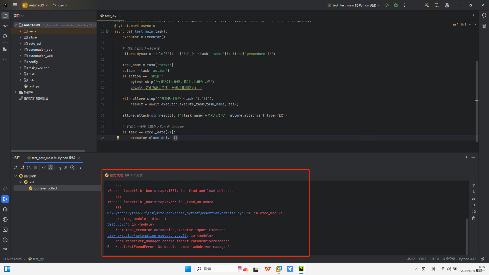
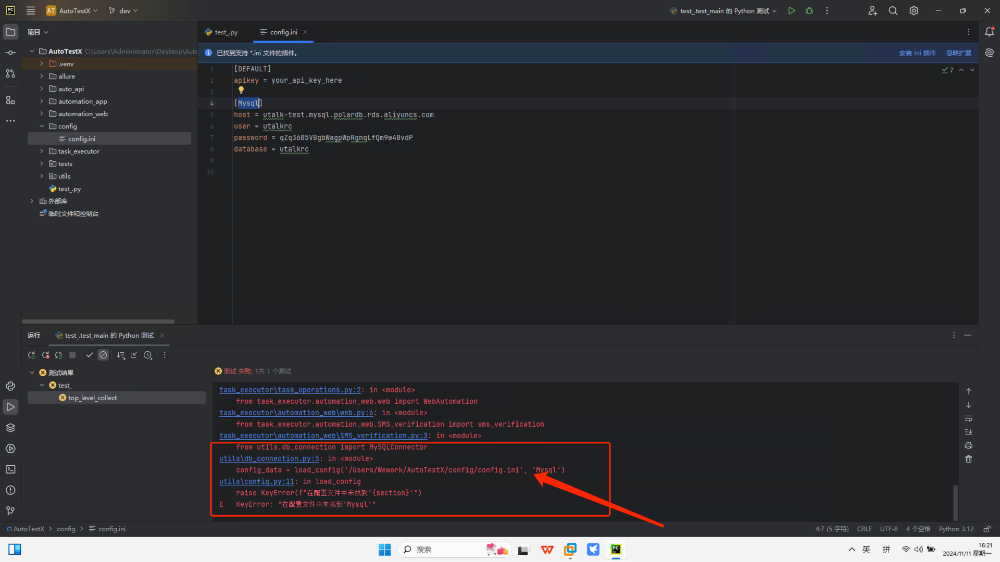
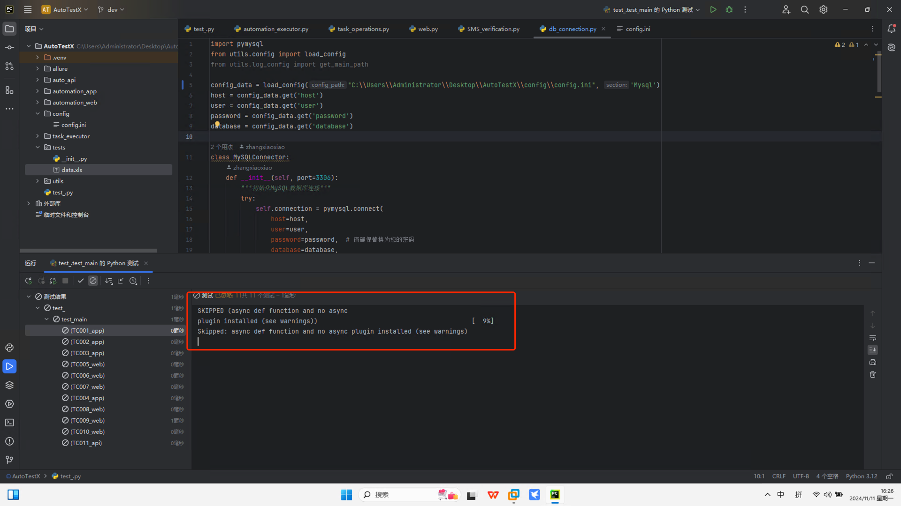
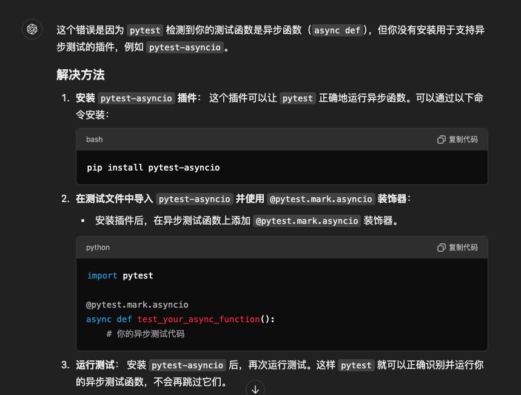
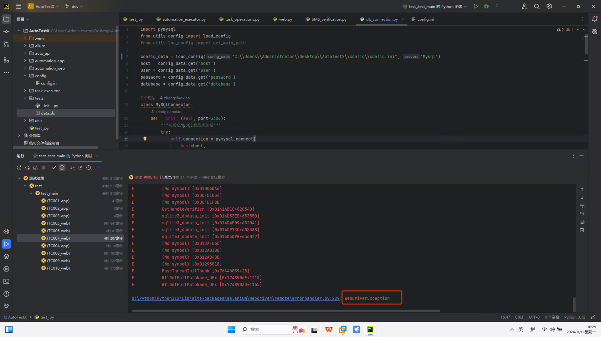
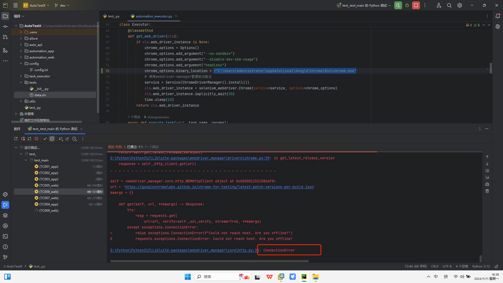

记录一次windwos 电脑搭建安装过程
1、git clone 之后出现了错误，
GPT 给的结局方法 

最终的优化方案
2、按照方案修改之后运行还是失败，发现是需要在线访问selenium其中一个地址访问不到，打开VPN，后出现WebDriverException，GPT给出的解决方案

3、至此问题解决



完整记录第二次windows 电脑搭建运行过程
1、新建一个全新的虚拟环境
直接还是报错。按照GPT给出的结局方案，直接执行
```bash
pip install webdriver_manager
```
2、运行的时候提示找不到mysql的配置，查看得知，没有实时获取路径，修改config配置文件的实时路径即可

3、修改了绝对路径之后还是无法运行（"C:\\Users\\Administrator\\Desktop\\AutoTestX\\config\\config.ini"
），因为全新的环境没有安装pytest异步函数GPT给出的解决方案

4、依旧报错 WebDriverException！！！ GPT给到了两个解决方案
    4.1 在代码中添加实际chrome 的exe文件的启动路径
    4.2 在环境变量中添加chrome 的环境变量
[录屏2024-11-11 16.30.55.mov](..%2F..%2F..%2Fzhangxiaoxiao%2FDesktop%2F%E5%BD%95%E5%B1%8F2024-11-11%2016.30.55.mov)
找到windows 中chrome 的exe执行文件在哪里，在代码中修改即可。添加在初始化device时
``` json
# 指定 Chrome 浏览器的二进制路径
chrome_options.binary_location = r"C:\Users\Administrator\AppData\Local\Google\Chrome\Bin\chrome.exe"  # 替换为实际路径
```    
5、依旧报错！！！链接问题，可按照以下方法进行处理或禁用代理，我禁用了代理，并且打开了VPN才能正常运行，当我关闭VPN的时候则无法正常运行了


至此成功运行起来了，这很重要不需要用到vpn也可运行

```python
    @classmethod
    def get_web_driver(cls):
        if cls.web_driver_instance is None:
            chrome_options = Options()
            chrome_options.add_argument("--no-sandbox")
            chrome_options.add_argument("--disable-dev-shm-usage")
            # 使用webdriver-manager管理驱动路径，配置 webdriver-manager 使用国内镜像源
            os.environ['WDM_MIRROR'] = 'https://registry.npmmirror.com/-/binary/chromedriver'
            service = Service(ChromeDriverManager().install())
            cls.web_driver_instance = selenium_webdriver.Chrome(service=service, options=chrome_options)
            cls.web_driver_instance.implicitly_wait(30)
            time.sleep(10)
        return cls.web_driver_instance
```